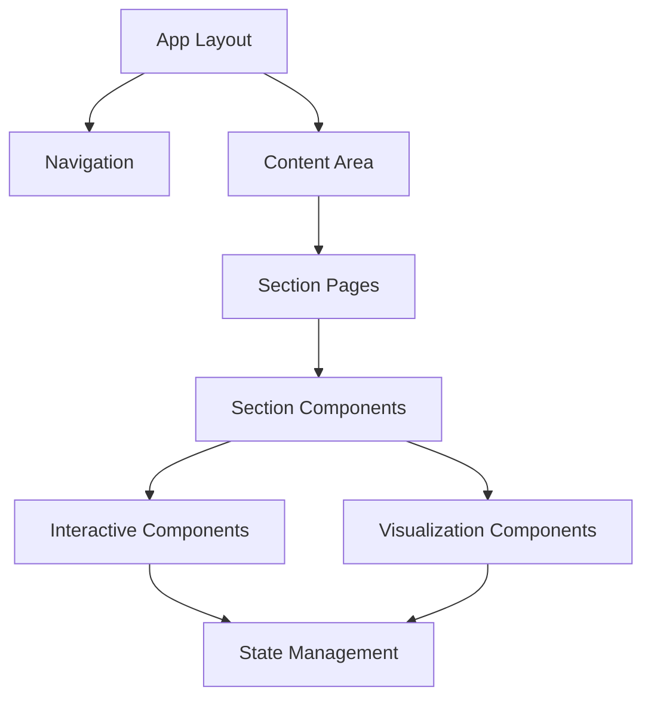
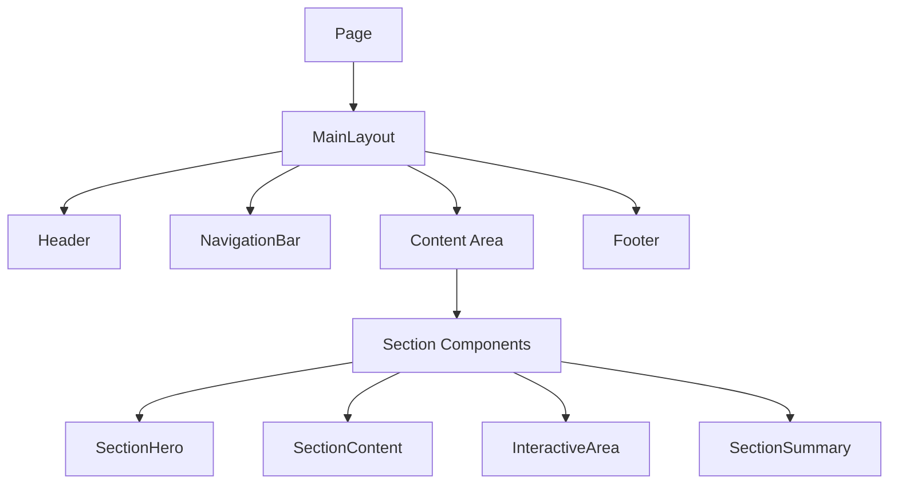

# System Patterns

## Architecture Overview
The AI presentation website follows a component-based architecture using Next.js with App Router and React. The system is structured around reusable components that compose into content sections, with a focus on interactive elements to demonstrate AI concepts.



## Core Design Patterns

### Component Composition Pattern
The application uses composition extensively to create complex UI from simpler components:



#### Implementation
```tsx
// Page Component (e.g., app/ki-uberblick/page.tsx)
export default function KIUberblick() {
  return (
    <div className="section-container">
      <SectionHero
        title="KI-Überblick"
        subtitle="Grundlagen, aktuelle Anwendungen und Trends"
      />
      
      <SectionContent>
        {/* Content elements */}
      </SectionContent>
      
      <InteractiveArea>
        {/* Interactive elements */}
      </InteractiveArea>
      
      <SectionSummary
        nextSection="/high-level-prompting"
        nextSectionTitle="High-Level Prompting"
      />
    </div>
  );
}
```

### Porsche Design System Extension
The application extends the Porsche Design System with custom components that follow PDS design principles:

1. **Base PDS Components**: Using official components from @porsche-design-system/components-react
2. **Wrapper Components**: Creating React wrappers around PDS components (e.g., PButton, PText, PHeading)
3. **Extended Components**: Adding custom components that follow PDS guidelines (e.g., PIcon)
4. **Consistent Styling**: Ensuring all custom components match PDS visual language

#### Implementation
```tsx
// PIcon.tsx - Custom icon component following PDS guidelines
"use client";

import React from 'react';

interface PIconProps {
  name: 'copy' | 'shield' | 'chart' | 'document'; // Support for various icon types
  className?: string;
  onClick?: () => void;
}

const PIcon: React.FC<PIconProps> = ({
  name,
  className = '',
  onClick,
}) => {
  const iconMap = {
    copy: (
      <svg 
        xmlns="http://www.w3.org/2000/svg" 
        viewBox="0 0 24 24" 
        fill="none" 
        stroke="currentColor" 
        strokeWidth="2" 
        strokeLinecap="round" 
        strokeLinejoin="round" 
        className={`w-5 h-5 ${className}`}
        onClick={onClick}
      >
        <rect x="9" y="9" width="13" height="13" rx="2" ry="2"></rect>
        <path d="M5 15H4a2 2 0 0 1-2-2V4a2 2 0 0 1 2-2h9a2 2 0 0 1 2 2v1"></path>
      </svg>
    ),
    shield: (
      <svg 
        xmlns="http://www.w3.org/2000/svg" 
        viewBox="0 0 24 24" 
        fill="none" 
        stroke="currentColor" 
        strokeWidth="2" 
        strokeLinecap="round" 
        strokeLinejoin="round" 
        className={`w-5 h-5 ${className}`}
        onClick={onClick}
      >
        <path d="M12 22s8-4 8-10V5l-8-3-8 3v7c0 6 8 10 8 10z"></path>
      </svg>
    ),
    chart: (
      <svg 
        xmlns="http://www.w3.org/2000/svg" 
        viewBox="0 0 24 24" 
        fill="none" 
        stroke="currentColor" 
        strokeWidth="2" 
        strokeLinecap="round" 
        strokeLinejoin="round" 
        className={`w-5 h-5 ${className}`}
        onClick={onClick}
      >
        <line x1="18" y1="20" x2="18" y2="10"></line>
        <line x1="12" y1="20" x2="12" y2="4"></line>
        <line x1="6" y1="20" x2="6" y2="14"></line>
        <line x1="2" y1="20" x2="22" y2="20"></line>
      </svg>
    ),
    document: (
      <svg 
        xmlns="http://www.w3.org/2000/svg" 
        viewBox="0 0 24 24" 
        fill="none" 
        stroke="currentColor" 
        strokeWidth="2" 
        strokeLinecap="round" 
        strokeLinejoin="round" 
        className={`w-5 h-5 ${className}`}
        onClick={onClick}
      >
        <path d="M14 2H6a2 2 0 0 0-2 2v16a2 2 0 0 0 2 2h12a2 2 0 0 0 2-2V8z"></path>
        <polyline points="14 2 14 8 20 8"></polyline>
        <line x1="16" y1="13" x2="8" y2="13"></line>
        <line x1="16" y1="17" x2="8" y2="17"></line>
        <polyline points="10 9 9 9 8 9"></polyline>
      </svg>
    ),
  };

  return iconMap[name] || null;
};

export default PIcon;
```

### Icon Integration System

The application uses a consistent approach to icons across all components:

1. **PIcon Component**: Central component for all icon rendering
2. **Icon Types**: Supports various icon types (copy, shield, chart, document, etc.)
3. **Flexible Integration**: Can be used directly or via string references in components like InfoCard
4. **Consistent Styling**: Maintains consistent appearance following PDS guidelines

#### InfoCard Integration Example
```tsx
// InfoCard.tsx - Using PIcon for icon rendering
"use client";

import React, { useState } from 'react';
import { motion, AnimatePresence } from 'framer-motion';
import PHeading from '@/components/ui/PHeading';
import PText from '@/components/ui/PText';
import PButton from '@/components/ui/PButton';
import PIcon from '@/components/ui/PIcon';

interface InfoCardProps {
  title: string;
  children: React.ReactNode;
  icon?: React.ReactNode | string; // Accept both React nodes and string icon names
  variant?: 'default' | 'info' | 'success' | 'warning' | 'error';
  collapsible?: boolean;
  initiallyExpanded?: boolean;
  className?: string;
}

const InfoCard: React.FC<InfoCardProps> = ({
  // Component implementation
}) => {
  // Other component logic

  // Get icon element based on variant or provided icon
  const getIconElement = () => {
    // If icon is a string, try to use PIcon
    if (typeof icon === 'string') {
      if (['shield', 'chart', 'document', 'copy'].includes(icon)) {
        return <PIcon name={icon as 'shield' | 'chart' | 'document' | 'copy'} className="h-6 w-6" />;
      }
    }
    
    // If icon is a React node, return it
    if (icon && typeof icon !== 'string') {
      return icon;
    }

    // Default icons for variants
    switch (variant) {
      case 'info':
        return (
          <svg xmlns="http://www.w3.org/2000/svg" className="h-6 w-6" fill="none" viewBox="0 0 24 24" stroke="currentColor">
            <path strokeLinecap="round" strokeLinejoin="round" strokeWidth={2} d="M13 16h-1v-4h-1m1-4h.01M21 12a9 9 0 11-18 0 9 9 0 0118 0z" />
          </svg>
        );
      // Other cases...
    }
  };

  return (
    <motion.div 
      className={`border rounded-lg overflow-hidden shadow-sm ${variantStyles[variant].border} ${className}`}
      initial={{ opacity: 0, y: 10 }}
      animate={{ opacity: 1, y: 0 }}
      transition={{ duration: 0.3 }}
    >
      <div className={`flex items-center p-4 ${variantStyles[variant].header} border-b ${collapsible ? 'cursor-pointer' : ''}`}>
        <div className={`mr-3 ${variantStyles[variant].icon}`}>
          {getIconElement()}
        </div>
        {/* Rest of component */}
      </div>
      {/* Rest of component */}
    </motion.div>
  );
};
```

### Layout Patterns
The application uses consistent layout patterns across all sections:

1. **Header + Navigation**: Persistent navigation with section links
2. **Hero Area**: Section introduction with title and subtitle
3. **Content Area**: Main content with text, diagrams, and examples
4. **Interactive Area**: Demonstration components and hands-on elements
5. **Summary**: Key takeaways and navigation to next section

#### Implementation
```tsx
// MainLayout.tsx
export default function MainLayout({ children }) {
  return (
    <div className="main-layout">
      <Header />
      <NavigationBar />
      <main className="content-area">
        {children}
      </main>
      <Footer />
    </div>
  );
}
```

### Component State Management
Different approaches to state management are used based on component complexity:

1. **Local Component State**: Using `useState` and `useReducer` for self-contained components
2. **Prop Drilling**: For simple parent-child relationships
3. **Composition with Render Props**: For flexible component customization
4. **React Context**: For shared state across component trees

### Interactive Component Pattern
Interactive components follow a consistent pattern:

1. **Input Area**: For user interaction
2. **Controls**: For configuration and actions
3. **Display Area**: For output and results
4. **State Feedback**: Loading states, error states, success states
5. **Copy Functionality**: For sharing or reusing content

#### Implementation Examples

```tsx
// CodeEditor.tsx
export default function CodeEditor({ initialCode, language }) {
  const [code, setCode] = useState(initialCode);
  const [output, setOutput] = useState('');
  const [isRunning, setIsRunning] = useState(false);
  
  const handleRunCode = () => {
    setIsRunning(true);
    try {
      // Execute code logic
      setOutput(/* result */);
    } catch (error) {
      setOutput(`Error: ${error.message}`);
    } finally {
      setIsRunning(false);
    }
  };
  
  return (
    <div className="code-editor">
      <div className="editor-container">
        <MonacoEditor
          value={code}
          onChange={setCode}
          language={language}
          options={{ /* editor options */ }}
        />
      </div>
      <div className="controls">
        <button onClick={handleRunCode} disabled={isRunning}>
          {isRunning ? 'Running...' : 'Run Code'}
        </button>
      </div>
      <div className="output-container">
        {output}
      </div>
    </div>
  );
}
```

```tsx
// PromptBuilder.tsx (simplified)
export default function PromptBuilder({ templates, parameters }) {
  const [prompt, setPrompt] = useState('');
  const [paramValues, setParamValues] = useState({});
  const [processedPrompt, setProcessedPrompt] = useState('');
  const [copyFeedback, setCopyFeedback] = useState(null);
  
  // Extract parameters from template
  const extractParameters = (template) => {
    // Implementation using regex to find {{parameter}} patterns
  };
  
  // Process prompt with parameter values
  const processPrompt = () => {
    // Replace {{parameter}} with actual values
  };
  
  // Copy functionality with feedback
  const handleCopy = () => {
    navigator.clipboard.writeText(processedPrompt);
    showCopyFeedback("Prompt copied!");
  };
  
  return (
    <div className="prompt-builder">
      <div className="template-section">
        <div className="header">
          <label>Prompt Template:</label>
          <button onClick={handleCopyTemplate}><PIcon name="copy" /></button>
        </div>
        <textarea value={prompt} onChange={handlePromptChange} />
      </div>
      
      <div className="parameters-section">
        {parameters.map(param => (
          <div className="parameter">
            <div className="header">
              <label>{`{{${param.name}}}`}:</label>
              <button onClick={() => handleCopyParam(param.name)}><PIcon name="copy" /></button>
            </div>
            <textarea 
              value={paramValues[param.name] || ''} 
              onChange={e => handleParamChange(param.name, e.target.value)}
            />
          </div>
        ))}
      </div>
      
      <div className="preview-section">
        <div className="header">
          <label>Preview:</label>
          <button onClick={handleCopy}><PIcon name="copy" /></button>
        </div>
        <div className="preview">{processedPrompt}</div>
      </div>
      
      <div className="controls">
        <PButton variant="primary" onClick={handleCopy}>Copy</PButton>
        <PButton variant="tertiary" onClick={handleClear}>Clear</PButton>
        <PButton variant="tertiary" onClick={handleReset}>Reset</PButton>
        {copyFeedback && <div className="feedback">{copyFeedback}</div>}
      </div>
    </div>
  );
}
```

```tsx
// FloatingPromptBuilder.tsx extends this pattern with floating window behavior
export default function FloatingPromptBuilder({ templates, parameters }) {
  // Similar state to PromptBuilder plus window state
  const [isOpen, setIsOpen] = useState(false);
  const [position, setPosition] = useState({ x, y });
  const [size, setSize] = useState({ width, height });
  const [isFullScreen, setIsFullScreen] = useState(false);
  
  // Window management functions
  const handleDrag = () => { /* Implementation */ };
  const handleResize = () => { /* Implementation */ };
  const toggleFullScreen = () => { /* Implementation */ };
  
  // Apply window presets
  const applyPreset = (preset) => {
    // Set predefined window sizes and positions
  };
  
  return (
    <>
      <FloatingButton onClick={toggleOpen} />
      {isOpen && (
        <DraggableWindow 
          position={position} 
          size={size}
          onDrag={handleDrag}
          onResize={handleResize}
        >
          <WindowHeader>
            <Title>Prompt Builder</Title>
            <PresetButtons onApply={applyPreset} />
            <FullScreenButton onClick={toggleFullScreen} />
            <CloseButton onClick={toggleOpen} />
          </WindowHeader>
          
          <WindowContent>
            {/* Same content structure as PromptBuilder */}
          </WindowContent>
          
          <ResizeHandle onMouseDown={handleResizeStart} />
        </DraggableWindow>
      )}
    </>
  );
}
```

### Visualization Component Pattern
Visualization components implement a consistent interface:

1. **Data Input**: Props for visualization data
2. **Rendering Logic**: Using appropriate visualization library
3. **Interaction Handlers**: For user interaction
4. **Responsive Behavior**: Adapting to container size

#### Implementation
```tsx
// MermaidDiagram.tsx
export default function MermaidDiagram({ definition, caption }) {
  const [svg, setSvg] = useState('');
  const containerRef = useRef(null);
  
  useEffect(() => {
    if (containerRef.current) {
      mermaid.initialize({ /* config */ });
      mermaid.render('mermaid-diagram', definition)
        .then(({ svg }) => {
          setSvg(svg);
        })
        .catch(error => {
          console.error('Mermaid rendering error:', error);
        });
    }
  }, [definition, containerRef]);
  
  return (
    <div className="mermaid-diagram-container">
      <div 
        ref={containerRef}
        className="diagram"
        dangerouslySetInnerHTML={{ __html: svg }}
      />
      {caption && <div className="caption">{caption}</div>}
    </div>
  );
}
```

## Section Implementation Pattern
Each content section follows a consistent implementation pattern:

1. **Page Component**: Container for section content
2. **Hero Component**: Section introduction
3. **Content Blocks**: Text and static visualizations
4. **Interactive Elements**: Hands-on demonstrations
5. **Summary Component**: Key takeaways and next section link

### Current Section Implementation Status:
- **KI-Überblick**: Implemented with introduction components
- **High-Level Prompting**: Implemented with prompt builder and examples
- **Kontextwahl**: Implemented with context selection components
- **Memory-Prompts**: Implemented with memory concepts and visualization
- **Automotive-Beispiele**: Implemented with use case examples, log analysis, and documentation templates
- **Microsoft Office KI-Produkte**: In progress
- **MCP-Server**: Planned
- **Ausblick & Trends**: Planned

## UI Enhancement Patterns
The application uses several UI enhancement patterns:

1. **Progressive Disclosure**: Showing information gradually to avoid overwhelming users
2. **Contextual Help**: Tooltips and information popovers for complex concepts
3. **Visual Hierarchy**: Using size, color, and spacing to guide attention
4. **Interactive Feedback**: Visual feedback for user actions

### Implemented UI Enhancement Components:
- **InfoCard**: For displaying supplementary information with consistent icon integration
- **Tabs**: For organizing related content
- **Tooltip**: For providing contextual help
- **ProgressIndicator**: For showing progress through sections

## Responsive Design Patterns
The application implements responsive design through:

1. **Flexible Layouts**: Using Flexbox and Grid for adaptive layouts
2. **Responsive Typography**: Scaling text based on viewport size
3. **Component Adaptation**: Changing component behavior based on screen size
4. **Mobile-First Approach**: Designing for mobile first, then enhancing for larger screens

## Monaco Editor Integration
The application integrates Monaco Editor for code editing:

```tsx
import { Editor } from '@monaco-editor/react';

export default function CodeEditor({ value, onChange, language }) {
  return (
    <Editor
      height="300px"
      language={language}
      value={value}
      onChange={onChange}
      options={{
        minimap: { enabled: false },
        scrollBeyondLastLine: false,
        fontSize: 14,
      }}
    />
  );
}
```

## Current Implementation Status

### Implemented Patterns
- ✅ Component Composition Pattern
- ✅ Layout Patterns
- ✅ Component State Management
- ✅ Interactive Component Pattern
- ✅ Visualization Component Pattern (partially)
- ✅ Section Implementation Pattern (partially)
- ✅ Responsive Design Patterns (partially)
- ✅ Animation Patterns (partially)
- ✅ PDS Integration Pattern
- ✅ PDS Extension with Custom Components

### Patterns In Progress
- 🔄 UI Enhancement Patterns
- 🔄 Advanced Visualization Patterns
- 🔄 Animation Sequence Patterns
- 🔄 Content Section Implementation

### Planned Patterns
- ⏭️ Schema Visualization Patterns
- ⏭️ Interactive Tutorial Patterns
- ⏭️ Content Navigation Patterns
- ⏭️ Advanced Animation Patterns

## Next Implementation Focus
1. Complete UI Enhancement Components
2. Finalize Visualization Component Patterns
3. Implement remaining Content Sections
4. Enhance Animation and Transition Patterns
5. Optimize Responsive Design Patterns
